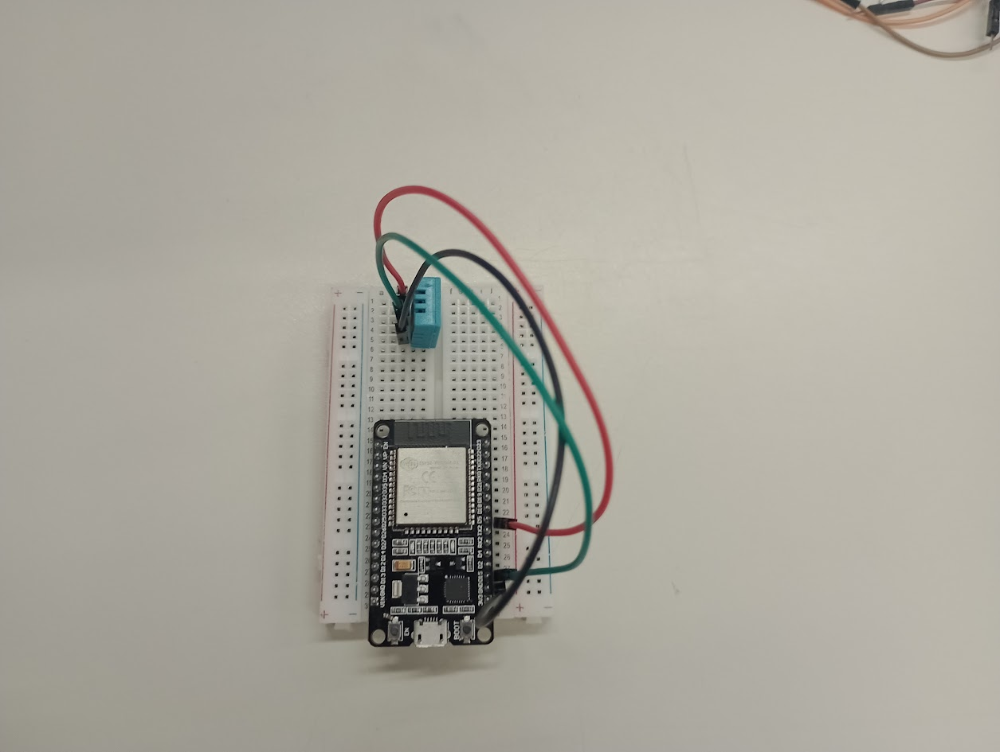

# DHT22
Passo a passo para montar um sensor DHT22.

1º Passo:
Para essa montagem você irá precisar de:
- 1 protoboard;
- 1 ESP32;
- 1 DHT22;
- 1 fio verde;
- 1 fio preto;
- 1 fio vermelho.

2º Passo:
Conecte o ESP32 na protoboard.

3º Passo:
Conecte o DHT22 na protoboard, de forma vertical, no lado (a,b,c,d,e) da placa.

4º Passo:
Agora iremos conectar o fio preto, um lado deverá ser colocado no encaixe ao lado da porta GND do ESP e o outro lado deverá ser colocado no primeiro encaixe ao lado do DHT22.

5º Passo:
Agora iremos conectar o fio vermelho, um lado deverá ser colocado no encaixe ao lado da porta 3V3 do ESP e o outro lado deverá ser colocado no último encaixe ao lado do DHT22.

6º Passo:
Agora iremos conectar o fio verde, um lado deverá ser colocado no encaixe ao lado da porta D15 do ESP e o outro lado deverá ser colocado no terceiro encaixe ao lado do DHT22.

7º Passo:
Agora conecte a fonte de alimentação do ESP32.

8º Passo:
Para testar o sensor, utilize o arduino IDE, instale a biblioteca Bonezegei_DHT11 e utilize o código de exemplo.
[Assista ao vídeo](https://github.com/AnaFlaviaD/DHT22/tree/main/img/video.mp4)

----------
Código de exemplo:

#include <Bonezegei_DHT11.h>

//param = DHT11 signal pin

Bonezegei_DHT11 dht(14);

void setup() {

  Serial.begin(115200);
  
  dht.begin();

}

void loop() {

  if (dht.getData()) {                         // get All data from DHT11

    float tempDeg = dht.getTemperature();      // return temperature in celsius

    float tempFar = dht.getTemperature(true);  // return temperature in fahrenheit if true celsius of false

    int hum = dht.getHumidity();               // return humidity

    String str  = "Temperature: ";

           str += tempDeg;

           str += "°C  ";

           str += tempFar;

           str += "°F  Humidity:";

           str += hum;

    Serial.println(str.c_str());

    //Serial.printf("Temperature: %0.1lf°C  %0.1lf°F Humidity:%d \n", tempDeg, tempFar, hum);

  }
  
  delay(2000);  //delay atleast 2 seconds for DHT11 to read tha data
  
}
